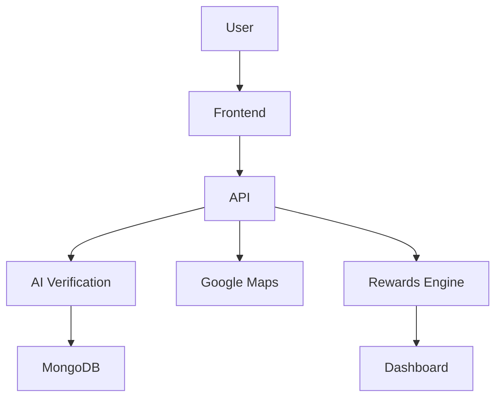

# EcoDrop – AI-Powered Smart E-Waste Recycling Platform


> AI-enabled e-waste recycling made simple, rewarding, and sustainable.

[](https://nextjs.org/)
[](https://www.typescriptlang.org/)
[](https://www.mongodb.com/)
[](https://developers.google.com/maps)
[](https://tailwindcss.com/)
[](https://en.wikipedia.org/wiki/Artificial_intelligence)

---

## Table of Contents

- [Project Overview](#project-overview)
- [Problem Statement](#problem-statement)
- [Project Objective](#project-objective)
- [Features](#features)
- [Screenshots](#screenshots)
- [Tech Stack](#tech-stack)
- [System Architecture](#system-architecture)
- [Installation](#installation)
- [Project Structure](#project-structure)
- [Future Scope](#future-scope)
- [Sustainable Development Goals](#sustainable-development-goals)
- [Team](#team)
- [Acknowledgements](#acknowledgements)
- [License](#license)

---

## Project Overview

EcoDrop is an AI-powered smart e-waste recycling platform designed to help users identify recyclable electronic items, locate authorized recycling centers, and earn rewards for responsible disposal. The platform combines artificial intelligence, location intelligence, and gamified sustainability tracking to make e-waste recycling fast, secure, and rewarding.

Through seamless Google Maps integration, EcoDrop enables users to find nearby recycling centers, scan items for verification, and track their environmental impact with a personalized dashboard. The solution is built for modern users who want a practical, motivating way to contribute to a circular economy.

## Problem Statement

- **Growing e-waste crisis**: Electronic waste is expanding rapidly, creating major environmental and health challenges.
- **Lack of awareness**: Many users are unsure which devices and components can be recycled safely.
- **Improper disposal**: Without proper guidance, e-waste often ends up in landfills and informal processing channels.
- **Limited access to recycling centers**: Users struggle to find reliable recycling locations in real time.
- **Need for AI-driven recycling**: Intelligent verification is needed to simplify disposal and build trust in the recycling process.

## Project Objective

EcoDrop aims to simplify and encourage responsible e-waste recycling through Artificial Intelligence, location intelligence, and gamification. The platform empowers users to make sustainable choices by verifying recyclable items, guiding them to nearby centers, and rewarding eco-friendly behavior.

## Features

- 🤖 **AI E-Waste Verification** – Intelligent item scanning and verification for reliable recycling recommendations.
- 📍 **Google Maps Integration** – Real-time location and directions for authorized recycling centers.
- 🎁 **Eco Rewards** – Points and rewards that motivate sustainable behavior.
- 🏆 **Gamification** – Leaderboards, achievement tracking, and progress metrics.
- 📊 **Sustainability Dashboard** – Personalized impact tracking with CO₂ savings and recycling history.
- 📱 **Responsive Design** – Mobile-friendly UI for seamless use on any device.
- 🔒 **Secure Authentication** – User accounts and protected app flows.
- ⚡ **Fast Performance** – Optimized Next.js experience for low-latency interactions.

## Screenshots

> Replace these placeholders with actual images from the project.

- **Home** – `public/screenshots/home.png`
- **Login** – `public/screenshots/login.png`
- **Scanner** – `public/screenshots/scanner.png`
- **Maps** – `public/screenshots/maps.png`
- **Rewards** – `public/screenshots/rewards.png`
- **Dashboard** – `public/screenshots/dashboard.png`

## Tech Stack

- **Frontend**: Next.js, React, TypeScript
- **Backend**: Next.js API Routes, Node.js
- **Database**: MongoDB, Mongoose
- **AI**: Custom verification logic, extensible for ML integration
- **Maps**: Google Maps Platform
- **Deployment**: Vercel or any cloud platform supporting Next.js

## System Architecture



## Installation

```bash
# Clone repository
git clone https://github.com/TheMukeshDev/EcodDrops.git
cd EcodDrops

# Install dependencies
npm install
```

Create a `.env.local` file with the following variables:

```bash
MONGODB_URI=your_mongodb_connection_string
NEXT_PUBLIC_GOOGLE_MAPS_API_KEY=your_google_maps_key
```

Start the development server:

```bash
npm run dev
```

Build for production:

```bash
npm run build
```

Deploy on Vercel or your preferred hosting platform.

## Project Structure

- `src/app` – Next.js pages and application routes
- `src/components` – Reusable UI components and feature widgets
- `src/lib` – Utility modules, services, and shared helpers
- `src/context` – React context providers for auth, theme, and localization
- `src/models` – Mongoose models and database schemas
- `src/hooks` – Custom React hooks
- `src/public` – Static assets, icons, and image placeholders
- `scripts` – Seed and helper scripts for development data

## Future Scope

- IoT Smart Bins
- Machine Learning Improvements
- Carbon Credit System
- Corporate Dashboard
- Government Integration
- Pickup Scheduling

## Sustainable Development Goals

- **SDG 11** – Sustainable Cities and Communities
- **SDG 12** – Responsible Consumption and Production
- **SDG 13** – Climate Action

## Team

### Team Revive & Thrive

- **Mukesh Kumar** — Team Leader
- **Deepa Tiwari** — Team Member

## Acknowledgements

- Google Maps Platform
- MongoDB
- Next.js
- Tailwind CSS
- Open Source Community

## License

MIT License

## Footer

Built with ❤️ by Team Revive & Thrive for Lenovo LEAP AI Hackathon 2.0 (2026).
